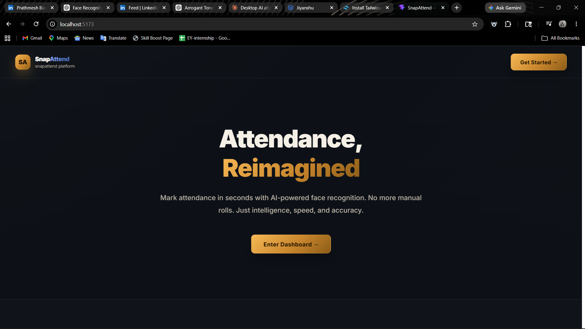
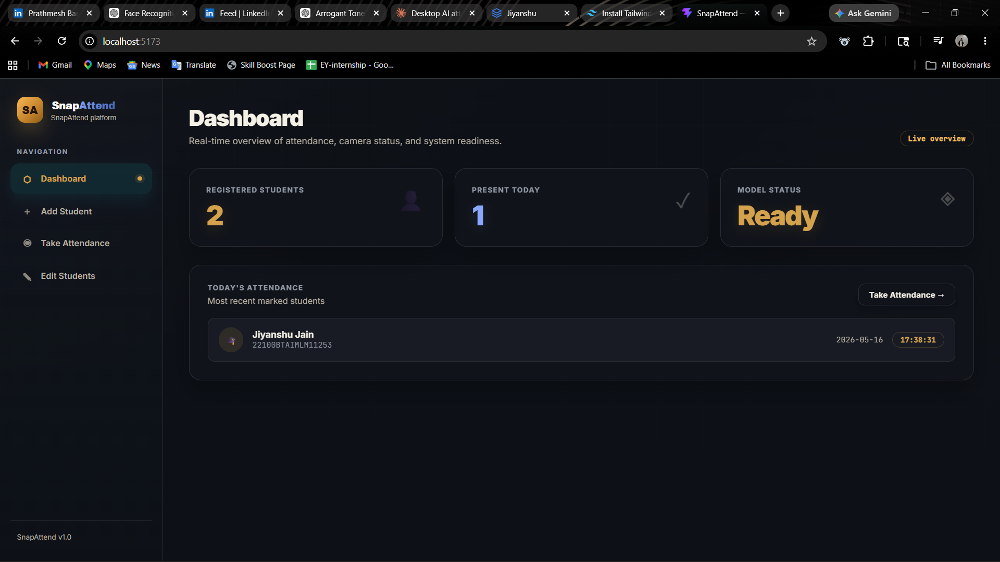
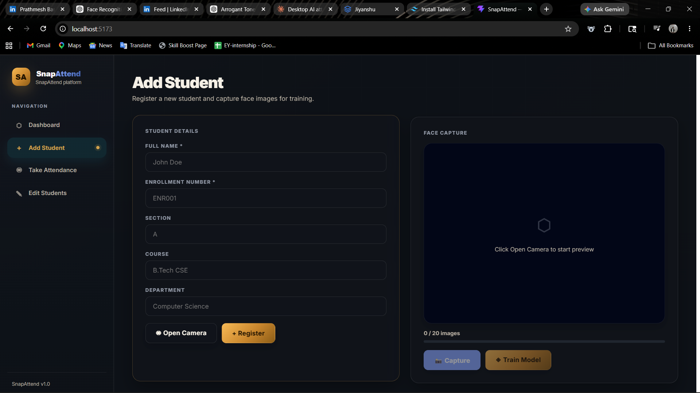
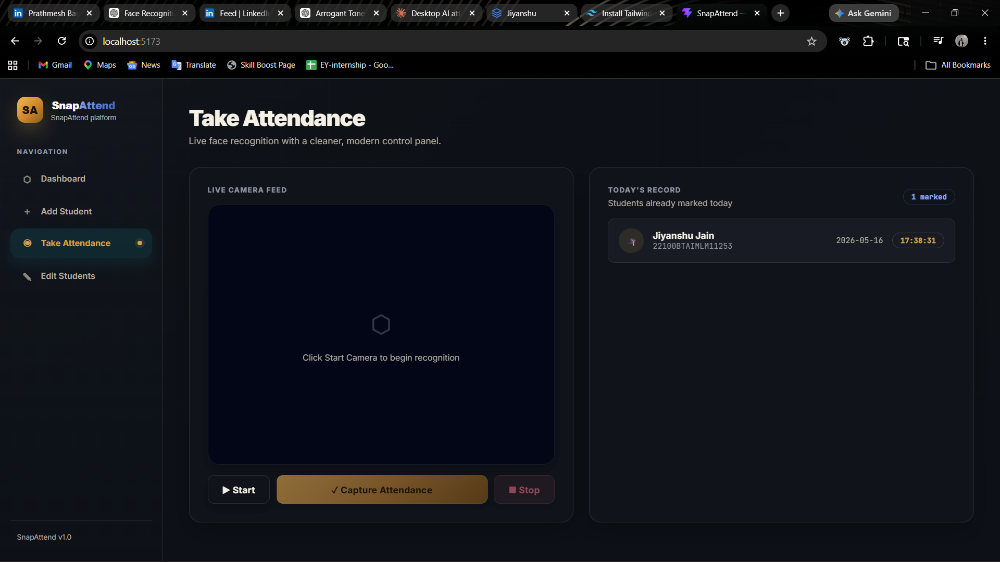
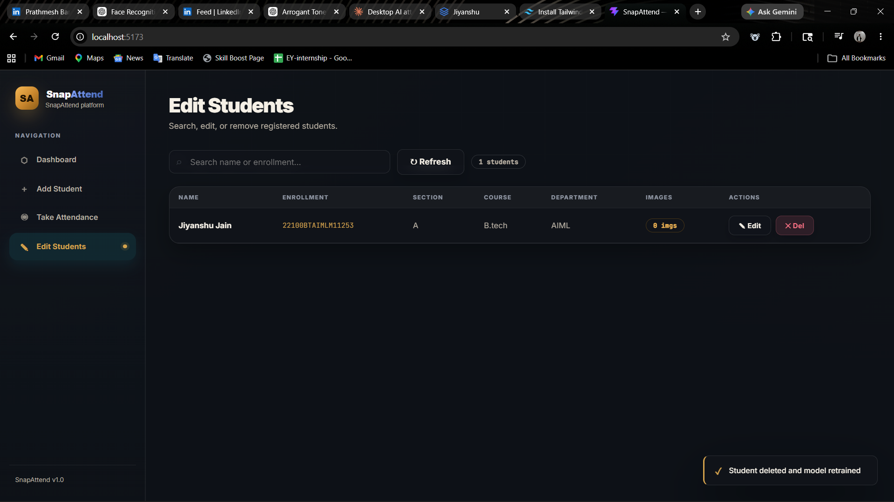

# 🎯 SnapAttend — Smart Face Recognition

A modern, AI-powered attendance management system that uses **facial recognition** to automatically mark attendance. Built with **Flask** backend and **React + Vite** frontend.

---

## ✨ Features

- **🔍 Smart Face Recognition** — KNN-based facial recognition for accurate student identification
- **📸 Live Camera Feed** — Real-time face detection with clean, intuitive UI
- **📊 Dashboard** — View attendance statistics and system status at a glance
- **👥 Student Management** — Add, edit, and manage student records easily
- **📋 Attendance Records** — Track daily attendance with timestamps
- **⚙️ Auto Model Training** — Automatically trains when students are added
- **🎨 Modern UI** — Beautiful dark-themed interface with smooth animations
- **🚀 API-Driven** — RESTful API for seamless frontend-backend communication

---

## 📸 Screenshots

### Home
Landing page with the SnapAttend branding and call-to-action.



### Dashboard
Real-time overview of attendance and system status.



### Add Student
Register new students and capture face images for training.



### Take Attendance
Live face recognition with real-time student identification.



### Edit Students
Manage existing student records with full CRUD operations.



---

## 🚀 Quick Start

### Prerequisites
- Python 3.8+
- Node.js 16+
- Webcam/Camera

### Backend Setup

```bash
cd backend

# Install dependencies
pip install flask flask-cors opencv-python numpy scikit-learn Pillow

# Run the API server (SnapAttend Backend on port 5000)
python attendance.py
```

The API will start on **http://localhost:5000**

**Startup Output:**
```
==================================================
MODEL STATUS ON STARTUP:
  Model File Exists: True/False
  Model Loaded: True/False
  scikit-learn Available: True
  KNN Model ready with 3 neighbors
==================================================

DATABASE INFO:
  Total Students: 1
    - 22100BTAIMLM11253: Jiyanshu Jain (20 images)

DATA FOLDERS:
  - 22100BTAIMLM11253: 20 images
```

### Frontend Setup

```bash
cd frontend

# Install dependencies
npm install

# Run the development server (SnapAttend UI on port 5173)
npm run dev
```

The UI will be available at **http://localhost:5173**

---

## 📁 Project Structure

```
SnapAttend/
├── backend/
│   ├── attendance.py           # Main Flask API
│   ├── requirements.txt        # Python dependencies
│   ├── data/                   # Student face images
│   │   ├── 22100BTAIMLM11253/  # Student enrollment folders
│   │   └── 22100BTAIMLM11252/
│   ├── model/                  # Trained KNN model
│   │   └── knn_model.pkl
│   ├── attendance/             # Daily attendance CSV files
│   └── students.db             # SQLite database
│
├── frontend/
│   ├── src/
│   │   ├── components/
│   │   │   └── attendance.jsx  # Main app component
│   │   ├── App.jsx
│   │   └── main.jsx
│   ├── index.html
│   ├── vite.config.js
│   ├── package.json
│   └── tailwind.config.js
│
├── Home.png
├── Dashboard.png
├── Add_student.png
├── Attendance.png
├── Student.png
└── README.md
```

---

## 🔌 API Endpoints

### Camera & Streams
| Endpoint | Method | Description |
|----------|--------|-------------|
| `/video_feed/add/<enrollment>` | GET | Live face detection for adding student |
| `/video_feed/attendance` | GET | Live face recognition for attendance |
| `/stop_camera` | POST | Stop camera stream |

### Students
| Endpoint | Method | Description |
|----------|--------|-------------|
| `/api/students` | GET | Get all students (supports `?q=` search) |
| `/api/students` | POST | Register new student |
| `/api/students/<enrollment>` | PUT | Update student details |
| `/api/students/<enrollment>` | DELETE | Delete student |

### Face & Model
| Endpoint | Method | Description |
|----------|--------|-------------|
| `/api/capture_face` | POST | Capture one face image for training |
| `/api/train` | POST | Manually trigger model retraining |

### Attendance
| Endpoint | Method | Description |
|----------|--------|-------------|
| `/api/attendance/capture` | POST | Capture attendance from current frame |
| `/api/attendance/today` | GET | Get today's attendance records |
| `/api/attendance/history` | GET | Get list of all attendance dates |
| `/api/attendance/<date_str>` | GET | Get attendance for specific date (YYYY-MM-DD) |

### Status & Debug
| Endpoint | Method | Description |
|----------|--------|-------------|
| `/api/status` | GET | Get system status (students, model ready) |
| `/api/debug` | GET | Full diagnostic info (model, database, folders) |

---

## 🧠 How It Works

### 1. **Face Detection**
- Uses OpenCV's Haar Cascade classifier
- Tuned parameters: `scaleFactor=1.1, minNeighbors=7` for accuracy
- Detects faces in real-time from webcam

### 2. **Model Training**
- Scans `data/` folder for student face images
- Extracts features: 64×64 grayscale face images → flattened vectors
- Trains KNN classifier with k=min(3, number_of_students)
- Persists model to `model/knn_model.pkl`

### 3. **Face Recognition**
- Resizes detected faces to 64×64
- Extracts features and compares with trained model
- Confidence threshold: 0.5 (50%)
- Returns enrollment number for recognized faces

### 4. **Attendance Recording**
- Captures frame and detects all faces
- Recognizes each face via KNN model
- Writes to `attendance/attendance_YYYY-MM-DD.csv`
- Prevents duplicate entries for same student per day

---

## 🔧 Key Configurations

### Face Detection Parameters
In `attendance.py`:
```python
faces = _face_cascade.detectMultiScale(
    gray,
    scaleFactor=1.1,      # Slower, more thorough scan
    minNeighbors=7,       # Stricter - filters noise
    minSize=(50, 50),     # Minimum face size
    maxSize=(400, 400)    # Maximum face size
)
```

### Model Settings
```python
k = min(3, len(set(y)))   # KNN neighbors
knn = KNeighborsClassifier(n_neighbors=k, metric="euclidean")
```

---

## 📊 Database Schema

### `students` table
```sql
CREATE TABLE students (
    id           INTEGER PRIMARY KEY AUTOINCREMENT,
    name         TEXT    NOT NULL,
    enrollment   TEXT    UNIQUE NOT NULL,
    section      TEXT,
    course       TEXT,
    department   TEXT,
    image_count  INTEGER DEFAULT 0
);
```

---

## 💾 Attendance Record Format

Daily CSV files (`attendance_YYYY-MM-DD.csv`):
```csv
Name,Enrollment,Date,Time
Jiyanshu Jain,22100BTAIMLM11253,2025-05-16,17:38:31
```

---

## 🎯 Usage Workflow

### Adding a New Student

1. Go to **"Add Student"** page
2. Fill in student details (Name, Enrollment, Section, etc.)
3. Click **"Open Camera"** to start preview
4. Click **"Capture"** button multiple times (15-20 images recommended)
5. Click **"Register"** to save student
6. Click **"Train Model"** to rebuild the KNN model

### Taking Attendance

1. Go to **"Take Attendance"** page
2. Click **"Start"** to begin live face recognition
3. Students position themselves in front of camera
4. System automatically recognizes and marks attendance
5. Click **"Capture Attendance"** to save to CSV
6. Click **"Stop"** to end session

### Viewing Attendance

1. Go to **"Dashboard"** to see today's records
2. Go to **"Edit Students"** to view all students and their image counts

---

## 🔍 Troubleshooting

### Model not loading?
- Check if `model/knn_model.pkl` exists
- Visit `/api/debug` endpoint for diagnostics
- Try hitting `/api/train` to retrain

### Faces not detected?
- Ensure good lighting
- Face should be 50-400 pixels (adjust minSize/maxSize if needed)
- Try increasing `minNeighbors` if false positives exist

### Poor recognition?
- Capture more images per student (20+ recommended)
- Retrain the model after adding images
- Ensure varied lighting/angles during capture

### Camera not working?
- Check camera permissions
- Ensure no other app is using camera
- Try `/stop_camera` endpoint and restart

---

## 🔒 Security Notes

- Database is SQLite (local file)
- No authentication implemented (meant for institutional use)
- Face images stored locally in `data/` folder
- API uses CORS for localhost development

---

## 📦 Dependencies

### Backend
- `flask` — Web framework
- `flask-cors` — Cross-origin requests
- `opencv-python` — Computer vision
- `numpy` — Array operations
- `scikit-learn` — KNN classifier
- `Pillow` — Image processing

### Frontend
- `react` — UI framework
- `vite` — Build tool
- `tailwindcss` — Styling
- `postcss` — CSS processing

---

## 🚀 Performance Tips

- Keep face images in good lighting
- Limit to 50 students for optimal performance
- Monitor `students.db` file size (backup if > 50MB)
- Clear old attendance CSVs periodically

---

## 📝 License

This project is part of an IBM internship program.

---

## 👥 Contributing

For improvements or bug reports, please create an issue with:
- Steps to reproduce
- Expected vs actual behavior
- Screenshots/logs if applicable

---

## 📞 Support

**Backend Issues:** Check `/api/debug` endpoint for diagnostics  
**Frontend Issues:** Open browser console (F12) for error messages  
**Camera Issues:** Restart Flask server and refresh frontend

---

**Built with ❤️ for Smart Attendance Management**

---

**SnapAttend** — Making attendance smarter, faster, and more accurate.
